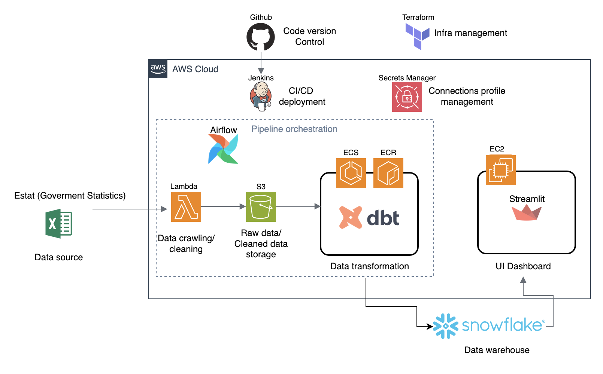
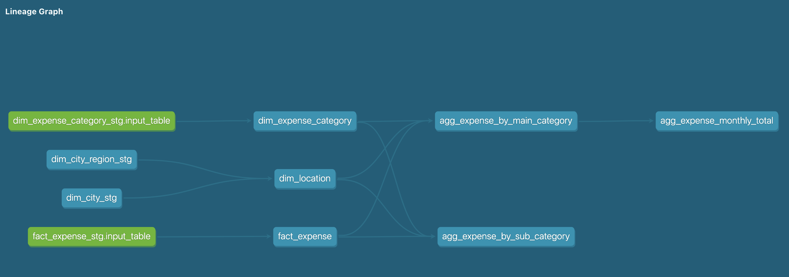

# 🏗️ Pipeline e-Stat DBT + Snowflake

A data pipeline project that orchestrates the process from  **data crawling → ingestion → transformation → visualization** , fully deployed on **AWS** with  **Airflow, Snowflake, dbt, Jenkins, Streamlit, and Terraform** .

---

## 📘 Overview

This project builds an end-to-end data platform using modern data engineering tools.

It automates data collection, transformation, and visualization for e-Stat (Japanese government statistics data).

The main components include:

* **AWS Lambda** — crawl and collect raw Excel data
* **Airflow** — orchestrate and automate all data workflows
* **dbt + Snowflake** — perform data transformations and modeling
* **Streamlit** — visualize aggregated results for end users
* **Jenkins** — automate CI/CD pipelines for Airflow deployment
* **Terraform** — manage all infrastructure as code for reproducibility

---

## 🧱 Architecture

<pre class="overflow-visible!" data-start="1164" data-end="1924">

</pre>

┌────────────┐
        │  Lambda    │──► Crawl raw Excel data → S3
        └─────┬──────┘
              │
              ▼
        ┌────────────┐
        │   Airflow  │──► Orchestrate DAGs:
        │ (on EC2)   │     - Trigger Lambda
        │             │     - Launch dbt ECS tasks
        └─────┬──────┘
              │
              ▼
        ┌────────────┐
        │  ECS Task  │──► Run dbt models in Snowflake
        │ (via ECR)  │
        └─────┬──────┘
              │
              ▼
        ┌────────────┐
        │ Snowflake  │──► Store & transform data
        └─────┬──────┘
              │
              ▼
        ┌────────────┐
        │ Streamlit  │──► Display dashboards for users
        │ (on EC2)   │
        └────────────┘

## Data models

## ⚙️ Components & Design Decisions

### 🪶 Airflow

* Runs as a Docker container on **EC2**
* Used for orchestrating data ingestion and transformation workflows
* Selected **EC2** for cost optimization (24/7 availability at lower cost than managed services)
* Future scalability: can migrate to Amazon MWAA or Kubernetes if DAG count grows

---

### ❄️ Snowflake

* Central data warehouse for storing and transforming data
* Used with dbt to model raw → clean → analytics layers

---

### 🧠 dbt

* Defines data transformations as version-controlled SQL models
* Runs inside **ECS Fargate** containers triggered by Airflow
* Uses **ECR** to store and deploy container images
* Optimized approach:
  * Instead of rebuilding the image on every dbt change, the container includes an `entry_point.sh` that pulls the latest code from GitHub each time it starts
  * Enables fast and scalable batch runs — multiple ECS tasks can run concurrently

---

### ⚙️ Jenkins

* Handles CI/CD pipelines for Airflow and code deployment
* Runs as a container on EC2
* Automates:
  * Pulling the latest DAGs to Airflow when GitHub changes are pushed
* Initially planned to manage dbt images but later simplified for maintainability
* Chosen for flexibility and ease of local customization (vs GitHub Actions)

---

### 📊 Streamlit

* Dashboard built in Python for quick visualization of Snowflake data
* Runs on EC2 (Docker container)
* Chosen for:
  * Speed of development
  * Cost efficiency for public-facing dashboards
  * No license costs compared to BI tools (like Tableau or QuickSight)

---

### 🧩 Terraform

* Used to provision all AWS infrastructure as code
* Enables:
  * Fast setup and teardown of environments
  * Version-controlled infrastructure configurations
  * Easy replication for dev / test / prod environments

---

### ☁️ AWS Services

| Service                   | Purpose                          | Reason for Choice                                       |
| ------------------------- | -------------------------------- | ------------------------------------------------------- |
| **Lambda**          | Crawl Excel data monthly         | Cheap, no infra maintenance, ideal for lightweight jobs |
| **EC2**             | Host Airflow, Jenkins, Streamlit | 24/7 uptime with cost control (can stop anytime)        |
| **ECS Fargate**     | Run dbt batch jobs               | Auto-destroy containers after completion                |
| **ECR**             | Store dbt container images       | Integrated with ECS                                     |
| **S3**              | Store raw data files             | Durable and simple                                      |
| **Secrets Manager** | Manage credentials               | Secure storage for Snowflake and other secrets          |
| **IAM**             | Manage roles and access          | Fine-grained permission control                         |

---

## 📈 Future Improvements

* Add more data sources and automatic schema validation
* Set up dev/test/prod Snowflake environments
* Move CI/CD  for tighter integration
* Add monitoring (CloudWatch + Airflow alerts)

👩‍💻 Author

* **tthuha236**

Building a scalable, cost-optimized data platform for e-Stat data using modern data tools.

Feel free to connect or contribute!
